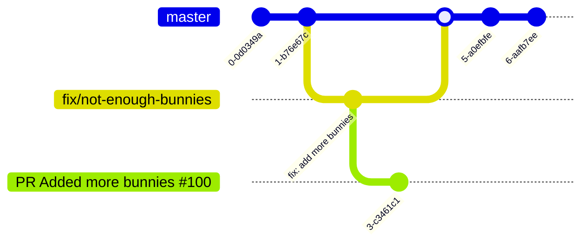

# Klaro Releases

| `KTH/klaro-js` Branch                                                                                                 | `KTH/klaro-js` Merge Commit `master`                                                         | `KTH/kth-style` Commit `main`                                                                 | `kth-style` Release Name                                   | `kth-style` Release Date | `klaro-org/privacy-manager` PR                                                                            | Notes                                                          |
| --------------------------------------------------------------------------------------------------------------------- | -------------------------------------------------------------------------------------------- | --------------------------------------------------------------------------------------------- | ---------------------------------------------------------- | ------------------------ | --------------------------------------------------------------------------------------------------------- | -------------------------------------------------------------- |
| [fix/csp-violation-for-style-attributes](https://github.com/KTH/klaro-js/tree/fix/csp-violation-for-style-attributes) | [`71cc75b`](https://github.com/KTH/klaro-js/commit/71cc75bde9ffb1e73fe1cee6fc2ca0ae9ba2df82) |                                                                                               |                                                            |                          | [fix: csp violation for style attributes #483](https://github.com/klaro-org/privacy-manager/pull/483)     | Included in older release.                                     |
| [fix/add-notice-title-in-swedish](https://github.com/KTH/klaro-js/tree/fix/add-notice-title-in-swedish)               | [`c17deb8`](https://github.com/KTH/klaro-js/commit/c17deb8a0b7448648e5c369497c3f33dae6ba39b) |                                                                                               |                                                            |                          | [fix: add notice title in Swedish #486](https://github.com/klaro-org/privacy-manager/pull/486)            | Included in older release.                                     |
| [fix/remove-core-js](https://github.com/KTH/klaro-js/tree/remove-core-js)                                             | [`8567112`](https://github.com/KTH/klaro-js/commit/8567112caf96664f50ba718fbd5ee93ba547361c) | [`061794a`](https://github.com/KTH/kth-style/commit/061794ac2c8d5a5c63511e89349bba1b348ab2ee) | [9.0.16](https://www.npmjs.com/package/kth-style/v/9.0.16) | 2024-01-09               | [Remove dependency to core-js #490](https://github.com/klaro-org/privacy-manager/pull/490)                |                                                                |
| [fix/aria-label-hidden-header](https://github.com/KTH/klaro-js/tree/fix/aria-label-hidden-header)                     | [`4ae5221`](https://github.com/KTH/klaro-js/commit/4ae52214700c98823bff6fa1c7e87ad184215d10) | [`b656d00`](https://github.com/KTH/kth-style/commit/b656d009bc6110a412626fe4a06503e22d996c93) | [9.0.18](https://www.npmjs.com/package/kth-style/v/9.0.18) | 2024-01-31               | [fix: aria-label when notice title is hidden #491](https://github.com/klaro-org/privacy-manager/pull/491) | New release of feature that was previously released, but lost. |

## Example

Mission statement: You found an error in _klaro_ and want to fix it, add it to _kth-style_, and make a new release.

1. Create a new branch in `KTH/klaro-js` from `HEAD` in `master`, e.g. `fix/not-enough-bunnies`.
2. Fix the error, e.g, commit `fix: add more bunnies`.
3. Build with `$ make`.
4. Commit changes in `dist`, e.g. `build: make`.
5. Create a new branch in `KTH/kth-style` from `HEAD` in `main`, e.g. `fix/klaro-with-more-bunnies`.
6. Copy `dist/klaro-no-css.js` in `KTH/klaro-js` to `public/js/klaro-no-css.js` in `KTH/kth-style`, branch `fix/klaro-with-more-bunnies`.
7. Commit change in `public/js/klaro-no-css.js`, e.g. `fix: klaro with more bunnies`
8. Do a prerelease of `kth-style`, e.g. `9.10.10-0`.
9. Test prerelease `kth-style@9.10.10-0`.
10. Merge `fix/klaro-with-more-bunnies` into `main` in `kth-style`.
11. Release `kth-style@9.10.10`. 🚀
12. Merge klaro changes in `kth-style@9.10.10` to branch `deprecation` in `kth-style`.
13. Merge `fix/not-enough-bunnies` into `main` in `KTH/klaro-js`.
14. Keep branch `fix/not-enough-bunnies` in `KTH/klaro-js` and make a pull request to `klaro-org/privacy-manager`. Remember to note any dependencies to previous pull requests from `KTH/klaro-js`.

### Git – KTH/klaro-js

### Git – KTH/kth-style

